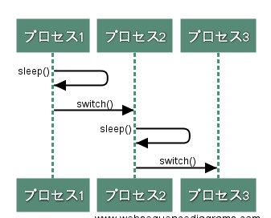
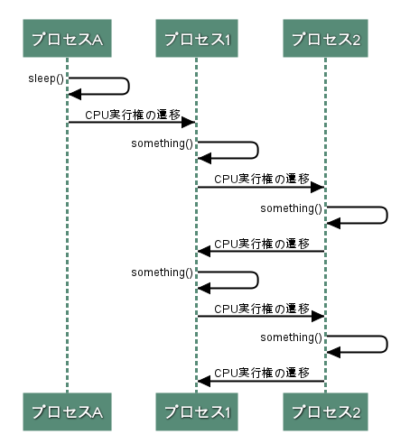

# 実行プロセスの切り替え

* 実行プロセスがカーネルのsleep()を実行すると`実行プロセスが休眠状態になって処理が中断された後に、swtch()が呼ばれて実行プロセスが切り替わる`

* カーネルのsleep()が実行されるのは次の場合
  * ユーザプログラムがwaitシステムコールを実行した時
  * 周辺デバイスの処理完了を待つ時
  * 使用中の資源が開放されるのを待つ時
* 実行状態になれるのは、実行可能状態のプロセスのみ
  * 休眠状態になったプロセスは、休眠状態が解消されるまでは再度実行状態になることはない

## プロセスの実行状態に設定される値
* プロセスの状態は、proc.p_statで表される
  * SRUNは実行可能状態、SSLEEPはSWAITは休眠状態
* sleep()は実行中のプロセスをSSLEEPまたはSWAITに設定する
  * wakeup()は対象のプロセスをRUMに設定する

## 実行プロセスの選択アルゴリズム

