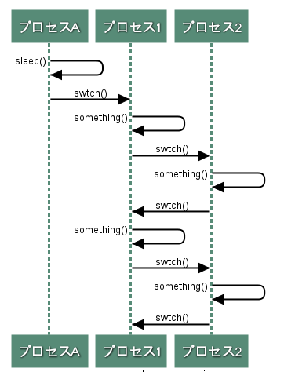

# 実行プロセスの切り替え

* 実行プロセスがカーネルのsleep()を実行すると`実行プロセスが休眠状態になって処理が中断された後に、swtch()が呼ばれて実行プロセスが切り替わる`


* カーネルのsleep()が実行されるのは次の場合
  * ユーザプログラムがwaitシステムコールを実行した時
  * 周辺デバイスの処理完了を待つ時
  * 使用中の資源が開放されるのを待つ時
* 実行状態になれるのは、実行可能状態のプロセスのみ
  * 休眠状態になったプロセスは、休眠状態が解消されるまでは再度実行状態になることはない




## プロセスの状態を表す値
* プロセスの状態は、proc.p_statで表される
  * SRUNは実行可能状態、SSLEEPはSWAITは休眠状態
* sleep()は実行中のプロセスをSSLEEPまたはSWAITに設定する
  * wakeup()は対象のプロセスをRUMに設定する

## 実行プロセスの選択アルゴリズム
* swtch()は、実行するプロセスを選択する
  * proc[]を舐めて、次の条件を満たしたプロセスを実行するプロセスとして選択する
    * 実行可能状態である
    * 実行優先度が最も高い(proc.p_priが最も小さい)
* 特定のプロセスを必ず実行する、ということはできない
* 実行時間が長いほど実行優先度が低くなっていく
  * 実行優先度で選択されるプロセスが決まるので、setpri()中の実行優先度計算式が実行プロセスの選択を決定しているといえる
    * setpri()はクロック処理、シグナル処理で登場する

## コンテキストスイッチ
* 実行プロセスが中出されるときには、user構造体に現在の実行状態を保存する。
* 中断していたプロセスが再度実行されるときには、user構造帯から実行状態を復元する
  * これをコンテキストスイッチと呼ぶ
* アセンブリで搔かれたsavu(),retu(), aretu()がコンテキストスイッチの中核をなす関数
  * savu()がuser構造帯への保存,retu(), aretu()がuser構造帯からの復元を行う

## waitシステムコール
* ユーザプログラムからwaitシステムコールが発行されると、そのプロセスの実行が中断され、別のプロセスへと制御が移る
* waitシステムコールには、子プロセスの処理完了を待つために実行プロセスの中断すること以外にも、終了した子プロセスの後始末を行うという役割がある
```shell
$ sleep 2 &; wait && echo done
```

## sleep()
* sleep()は実行中のプロセスを休眠状態にする
  * その後、swtch()を実行して実行プロセスを切り替える
* sleep()は引数chan, priを受ける
  * chanには変数などのアドレスが渡され、その値は実行プロセスのproc.p_wchanにセットされます。
  * wchanは waiting channelを意味し、`このプロセスはproc.p_wchanで示される資源を持っている`ということを表す
* プロセスの状態を休眠状態から実行可能状態へと変更する、wakeup()はsleep()と同様に変数などのアドレスを引数として受け、proc.p_wchanを順に調べ、引数と一致するプロセスを実行可能状態にする
  * sleep()とwakeup()を使って、複数プロセス間で資源を持ち合う処理を行なっている

#### ken/slp.c
```c
sleep(chan, pri) {
  register *rp, s;
  s = PS->integ;
  rp = u.u_procp;

  if(pri >= 0) {
    if(issig()) { goto psig; }
    spl6();
    rp->p_wchan = chan;
    rp->p_pri = pri;

    spl0();
    if(runin != 0) {
      runin = 0;
      wakeup(&runin);
    }
  } else {
    spl6();
    rp->p_chan;
    rp->p_stat = SSLEEP;
    rp->p_pri = pri;
    spl0();
    swtch();
  }
  PS->integ = s;
  return;
psig:
  aretu(u.u_qsav);
}
```

* priは、実行優先度を表し、実行プロセスのproc.p_priにセットされる
  * この値が起きた(wakeup)時の実行優先度になる
* また、priが0以上ならば実行プロセスを切り替える前と、そのプロセスが再び実行プロセスとして選択された後にシグナルの処理を行う
  * 0未満ならばシグナルを無視する
  * 0以上の場合は、SWIT状態、0未満の場合はSSLEEP状態になる
  * この2つの異なる状態は第4章で説明するスケジューリング処理に影響が出る
