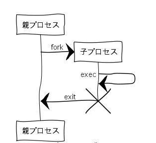
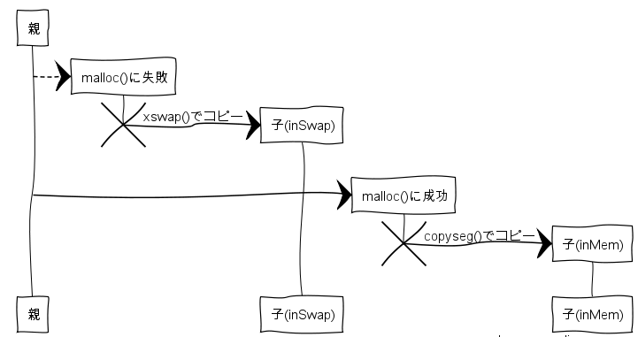

# プロセスの生成
## プロセスのライフサイクル


* forkすると同じ情報(後述)を持つプロセスのコピーを作る
  * forkを実行したプロセスを親プロセスと呼び、forkによって作られたプロセスを子プロセスと呼ぶ
* forkの戻り値が親と子で違うのでそれで別の処理を実行させる
* 子プロセスは、親プロセスのPIDをprocエントリに格納している
* 親プロセスが子プロセスを調べるには、procエントリを舐めなければわからない

## Cプログラム

```c
// fork関数は、forkシステムコールのラッパー
i = fork();
if(i == 0) {
  execv(program_name, argc);
  exit(); // execvを失敗した時のためのexit()
}
while(wait() != i);
```
* 親プロセスは、子プロセスが終了した時に終了状態を取得し、リソースの解放などを行う
* 子プロセスのproc構造体のp_ppid に親プロセスのpidを格納する

## forkでコピーされる情報について
* コピーされる
  * proc構造体
  * データセグメント
    * PPDA、オープン済みファイルやカレントディレクトリ情報などが引き継がれる
* コピーされない
  * テキストセグメント
    * 親のテキストセグメントを参照している
* 別プロセスなのでお互いの動作が影響しあうことはない
* execするとテキストセグメントの共有はしなくなる


## forkシステムコール
下記順番で処理される
* Cプログラムのfork関数
* sys fork
  * アセンブリ
  * スタックを上っていくときに親子で処理が分岐している
* (カーネル)forkシステムコール
  * ここで子プロセスの分も実行される

```c
fork() {
  // p1 が親、p2が子
  refister struct proc *p1, p2;
  p1 = u.u_procp;
  for(p2 = &proc[0]; p2 < &proc[NPROC]; p2++) {
    if(p2->p_stat == NULL) {
      goto found;
    }
  }
  u.u_error = EAGAIN;
  goto out;

found:
  if(newproc()) {
    u.u_ar0[R0] = p1->p_pid; // ※1
    // user[]を初期化をする
    u.u_cstime[0] = 0; // 子プロセスがカーネルモードとしてCPUを使用した時間
    u.u_cstime[1] = 0;
    u.u_stime     = 0; // カーネルモードとしてCPUを使用した時間
    u.u_cutime[0] = 0; // 子プロセスがユーザモードとしてCPUを使用した時間
    u.u_cutime[1] = 0;
    u.u_utime     = 0; // ユーザモードとしてCPUを使用した時間
    return;
  }
  u.u_ar0[R0] = p2->p_pid;

out:
  u.u_ar0[R7] =+ 2; // 親プロセスのプログラムカウンタを1命令文進める(アセンブリ
}
```
### 親プロセス
* proc[]を舐めて空きエントリを探す
  * 空きがあれば、foundラベルにgotoする
* newproc()で0が返ってくる
* 子プロセスのpidを`u.u_ar0[R0]`に格納する
  * `u.u_ar0[R0]`はアセンブリでR0に参照できる
  * カーネルfork終了後は、アセンブリに戻って`R0`が親プロセスfork()関数の戻り値になる

`u_ar0`はシステムコール処理時にユーザプロセスの汎用レジスタやPSWを操作するときに使用される

### 子プロセス
* カーネルfork内のnewproc()から値が返ってくるところから子プロセスの処理が開始される
* newproc() の戻り値が1になる
  * ifの中で子プロセスの初期化処理をしている
  * 初期化していない項目はそのまま引き継いでいる
* ※1) 親プロセスのpidを`u.u_ar0[R0]`に設定する
  * アセンブリに戻ると、レジスタR0を`_par_uid`にコピーする
  * そのあと, レジスタR0に0を設定し、Cライブラリのfork関数の戻り値にR0が戻る
    * 子プロセスのCライブラリfork()関数の戻り値は0が返ってくる
  * 子プロセスから親プロセスpidを取得するときは`_par_uid`を参照する

## newproc()
* newproc()はプロセスの生成を行う関数
* 実行しているプロセスは親プロセス
* これから親となるプロセスのproc[]エントリとデータセグメントを子プロセスにコピーする
  * テキストセグメントはコピーせず、共有する



```https://www.websequencediagrams.com
親-->*malloc()に失敗:
malloc()に失敗->*子(inSwap): xswap()でコピー
destroy malloc()に失敗

親->*malloc()に成功:
malloc()に成功->*子(inMem):copyseg()でコピー
destroy malloc()に成功
```

* 次期子プロセスpidの値は、mpidというグローバル変数で管理している
  * それをインクリメントして決定する
  * int型
      * unsigned型は当時なかった
* proc[]を先頭から舐めて、空いているエントリを探す
  * 一番先頭を探す(本が太文字になっている)
    * 空きがない場合、proc[]が枯渇していると見なしてpanic()を呼び出してOSが停止する
  * 空きエントリを探しつつ、格納しようとしているpidと同一のpidがないか確認をしている
    * 同一pidが存在している場合は、pidを再取得しretryする
* 先ほど見つけてきた空きproc[]エントリに次の設定を行う
  * 初期化処理です
    * 実行可能状態(proc.p_statがSRUN)
    * メモリ中に存在する(SLOADフラグが立ってる)
    * IDを割当(mpidをproc.p_pidに設定する)
    * 実行時間を0(proc.p_timeが0)
    * 親プロセスが実行プロセス(proc.p_ppidに実行プロセスのproc.p_pidをセットする)
* オープン済みファイル情報は子プロセスに引き継がれるので、fdの参照カウンタをインクリメントする
  * 参照カウンタが0になるとGCされるやつ
* text[]\(テキストセグメント\)を子プロセスも参照するので、こちらの参照カウンタもインクリメントする
* 親プロセスのuser.procp(proc pointer)をnew proc[] を一時的に指すように変更する
  * この状態でデータセグメントをコピーすれば、子プロセスのuser.procp が子プロセスを指すようになるため
    * 一時的な切り替えをしないと子プロセスが親プロセスのデータセグメントを指してしまう
* malloc()でメモリを確保する
  * 確保できた時
    * メモリ中にデータセグメントがコピーされる
  * 確保できなかった時
    * 親プロセスのデータセグメントがスワップ領域にコピーされ、スワップインするときにメモリ領域を確保します
    * もっと詳しく
      * 親プロセスの状態をSIDLにする
        * SIDL状態は、実行プロセスにもなれないし、スワップアウト対象にならない
          * SIDL状態は処理が完了するまでの間に実行対象やスワップ対象になってデータが変化してしまうのを防いでいる
          * RDBの行ロックみたいな感じ
      * xswap()を実行すると親プロセスのデータセグメントをスワップ領域にコピーする処理が実行される
      * xswap()中では親プロセスはその処理が完了するまで休眠状態に入る
    * メモリを確保できなかった場合にパフォーマンス悪化しまくる理由がわかる
* 一時的に親プロセスのuser.procp(proc pointer)をnew proc[] を指すようにしていたのを戻す
* 0をreturnする
  * newproc()で親プロセスが0を受け取っているのはここの値

## panic()
* idel()を無限に呼び出して、処理の継続を止める関数
* 資源の枯渇など、カーネルの処理を継続できなくなった場合に実行されます
* idle()内ではプロセッサ優先度を0にしてっっから、割り込み待ちのアセンブラ命令waitを実行します

```c
panic(s) chara *s {
  panicstr = s;
  update();
  printd("panic: %s\n", s);
  for(;;) {
    idel();
  }
}
```
Cの関数は、先頭にアンダースコアのついたラベルに変換される
```m40.s
.globl _idel
idel:
  mov PS,-(sp)
  bic $340,PS
  wait
  mov (sp)+,PS
  rts pc // C空間に戻る
```

完
